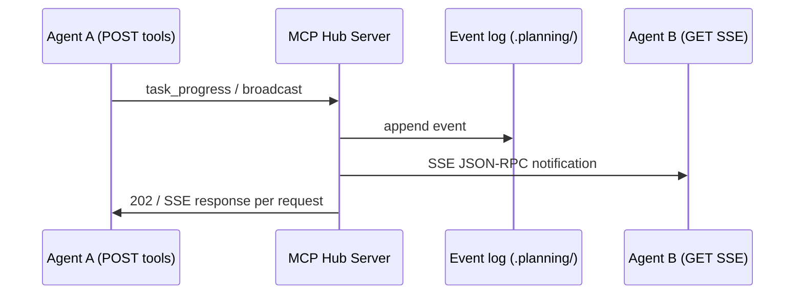
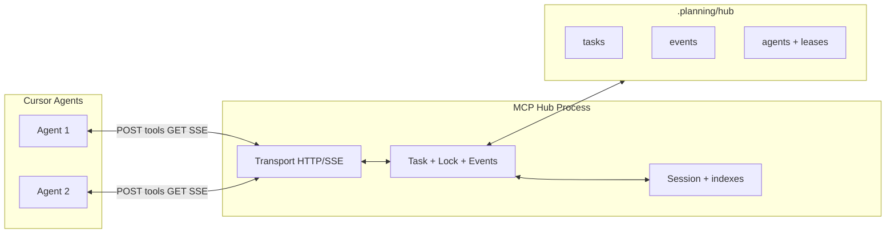

# Architecture: MCP Hub for Multi-Agent Collaboration (gsd-2)

**Domain:** Autonomous multi-agent coordination via MCP  
**Researched:** 2026-04-07  
**Spec baseline:** [MCP Transports — 2025-03-26](https://modelcontextprotocol.io/specification/2025-03-26/basic/transports) (Streamable HTTP replaces legacy HTTP+SSE)

---

## 1. Executive shape

Use **one long-lived MCP server process** exposing **Streamable HTTP** on **localhost** (`127.0.0.1`). Each Cursor Agent is a **separate MCP client session** (`Mcp-Session-Id`). The server is the **only** place that knows all agents and fans out **broadcasts** to per-session **SSE streams** (HTTP GET). Durable coordination state lives primarily under **`.planning/`** (files); the server holds **in-memory indexes** for routing, leases, and fast lookups, rebuilt or synced from disk on startup.

This matches the protocol: **stdio** ties one server process to one launched client; **Streamable HTTP** is explicitly for a server that **handles multiple client connections** and can stream **server→client** notifications over SSE.

---

## 2. MCP server architecture

### 2.1 Single process, multiple sessions

| Approach | Verdict |
|----------|---------|
| **One Node process, Streamable HTTP** | **Recommended.** One hub, one fan-out implementation, shared task/lock store. |
| **stdio per Agent** | **Wrong for a shared hub.** Each client typically spawns its own subprocess; agents would not share one process or one in-memory graph without extra machinery. |
| **Multiple MCP servers + sync** | Possible later for HA; v1 adds operational cost without clear benefit. |

### 2.2 Transport: not stdio for the hub

Per MCP:

- **stdio:** client launches server as subprocess; stdin/stdout only — natural fit for **one** IDE attachment, not a multi-tenant hub.
- **Streamable HTTP:** single MCP endpoint (POST + optional GET); server may assign **`Mcp-Session-Id`**; client sends session on subsequent requests; **GET** may open an SSE stream for **server-initiated** JSON-RPC messages to that client.

**Answer:** Use **Streamable HTTP** (the current spec’s remote/multi-connection transport). It subsumes the older “HTTP+SSE” pattern from 2024-11-05; implement **POST** for tools/requests and **GET** with `Accept: text/event-stream` for **per-agent** downstream events.

**Security (spec):** validate `Origin`, bind to **127.0.0.1** locally, add auth if exposed beyond loopback.

### 2.3 Internal modules (component boundaries)

| Module | Responsibility | Talks to |
|--------|----------------|----------|
| **Transport adapter** | HTTP server, session headers, SSE lifecycle, JSON-RPC envelope | OS / Node HTTP |
| **Session registry** | `sessionId` ↔ agent identity, capabilities, last activity | Transport, broadcast, heartbeat |
| **Task service** | Create, assign, transition tasks; leases; idempotency keys | Persistence, locks |
| **Lock / conflict service** | File-scoped leases, optional TTL, contention events | Task service, broadcast |
| **Event log + broadcast** | Append-only events; fan-out to subscribed SSE streams; optional replay | Session registry, transport |
| **Persistence adapter** | Atomic writes under `.planning/`; snapshots; crash recovery | FS only in v1 |
| **Tool handlers** | Map MCP tools → services | All services |

**Boundary rule:** Agents **never** talk to each other directly; all cross-agent visibility goes **through the server** (and optionally **read-only** consistency via `.planning/` for recovery).

---

## 3. Agent lifecycle

### 3.1 Registration

1. Cursor connects to `http://127.0.0.1:<port>/mcp` (exact path is your choice; spec uses one endpoint for POST/GET).
2. Standard MCP **initialize**; server returns **`Mcp-Session-Id`** (required for stateful hub).
3. Agent invokes a **custom tool** e.g. `hub_register` with: `agent_id` (stable string), `role`, `workspace_root`, optional `labels`.
4. Server persists registration record under e.g. `.planning/hub/agents/<agent_id>.json` and maps **`Mcp-Session-Id` → `agent_id`** in memory.

### 3.2 Heartbeat

- **Primary:** periodic **tool call** `hub_heartbeat` (e.g. every 30–60s) with `agent_id` + optional load stats. Survives SSE quirks and works everywhere.
- **Secondary:** activity on **GET SSE** counts as liveness if you define it that way; still recommend **explicit heartbeat** for clear timeouts.

### 3.3 Deregister / failure

- **Clean exit:** tool `hub_deregister` or MCP **HTTP DELETE** on endpoint with `Mcp-Session-Id` (per spec) to terminate session; server marks agent **offline**, releases **leases** owned by that session.
- **Timeout:** no heartbeat beyond TTL → same as crash: release leases, broadcast `agent_stale` / `lease_released` events.

---

## 4. Task queue design

### 4.1 Model

- **Logical queue:** tasks are rows/records with state machine, not an anonymous FIFO only.
- **Suggested states:** `pending` → `claimed` → `in_progress` → `done` | `blocked` | `failed`; optional `cancelled`.
- **Assignment:** **claim with lease** — `claim_task({ agent_id, lease_ttl })` returns at most one task and marks it `claimed` by that agent until lease expires or `complete_task` / `release_task` runs.
- **Creation:** any authorized agent (or bootstrap script) calls `task_create` with payload, dependencies, and file paths touched (for locking).

### 4.2 Storage

- **Source of truth:** append-heavy or atomic JSON/JSONL under `.planning/hub/tasks/` (or split files by id) with **write-through** from the server.
- **In-memory:** index by state and priority for fast `claim`; rebuild from disk on startup.

### 4.3 Tracking

- **Progress:** `task_progress` tool updates % / checklist; server appends **event** to log and broadcasts.
- **Idempotency:** clients send `client_message_id` on mutating calls to avoid double-claim after retries.

---

## 5. Broadcast mechanism

**Goal:** every agent receives updates about others’ work without polling-only UX.

**Recommended pattern:**

1. Each session maintains a **GET SSE** connection (when Cursor’s MCP client supports it for Streamable HTTP) for **server→client** JSON-RPC notifications: `broadcast`, `task_updated`, `lease_contested`, etc.
2. Server **appends** each message to a **durable event log** (file under `.planning/hub/events/` or single JSONL with rotation).
3. **Fan-out:** for each new event, iterate active sessions (except optional excluded source) and **emit on that session’s SSE** only (spec: each message on **one** stream; implement **logical** broadcast by **N parallel single-stream sends**).
4. **Catch-up / reconnect:** clients pass **`Last-Event-ID`** (SSE) per spec; server replays from cursor for that stream’s session. If Cursor client does not expose GET SSE reliably, provide **fallback tool** `hub_poll_events({ after_seq })` returning the same payloads (pull model).

**Data flow (broadcast):**



---

## 6. Conflict resolution (multi-agent file editing)

**Reality:** the hub cannot merge arbitrary concurrent edits like a CRDT; **prevent** and **detect** conflicts, then **escalate** or **serialize**.

| Layer | Mechanism |
|-------|-----------|
| **Prevention** | **Lease** on **path prefixes** or files: `acquire_path_lease({ paths[], ttl })` before edit; refuse conflicting `acquire` from another agent (or queue intent). |
| **Detection** | Optional: hash of file at claim time vs at write time; `git` dirty checks; broadcast `contention` when second agent requests overlapping lease. |
| **Resolution policy** | **Deterministic:** first lease wins; second gets `blocked` task or `conflict` event with suggested owner. **Human / lead agent** resolves via explicit `task_reassign` or manual merge — same as GSD-style workflows. |
| **Git** | Treat **git** as final arbiter for textual merge; hub coordinates **who may touch what**, not semantic merge. |

Avoid silent last-writer-wins across agents without lease — that is the main pitfall to design against.

---

## 7. State management: memory vs file vs database

| Store | Role in v1 |
|-------|------------|
| **Files under `.planning/`** | **Authoritative** for tasks, agent registry, event log, locks — survives hub restart, matches PROJECT.md. |
| **In-memory** | Session→agent mapping, open SSE handles, lease timers, priority queues — **rebuild** from files + optional WAL on boot. |
| **Embedded DB (e.g. SQLite)** | **Optional** later if JSONL contention or query complexity hurts; not required for first architecture cut. |

**Hybrid rule:** mutate disk **then** notify; on notification failure, state is still consistent for the next poll/reconnect.

---

## 8. The “agent loop” problem (must-have concrete answer)

**Problem:** Cursor Agents are **chat turns** in a GUI; there is no true OS daemon “running forever.” The human is not always there to say “continue.”

**What actually works (layered):**

### 8.1 Inner tool loop within one user turn (primary)

In Agent mode, the model can chain many **tool calls** in one user-initiated run. **Design hub operations to be batchable:** e.g. `hub_work_cycle` that **claims → returns task payload →** (agent does file ops locally) → **reports progress in the same tool** or minimal follow-up tools to avoid burning the budget on chatter.

**Constraint (product-specific, validate in your Cursor build):** published material suggests **on the order of ~20–30 tool calls per interaction** before the UI asks for **Continue** (usage/quota and product limits change). Treat this as a **budget**, not as infinite autonomy.

**Implications:**

- **Minimize round-trips** to the hub (batch events, compress polls).
- **Persist checkpoint** after each task slice so **Continue** resumes cleanly.
- **System prompt / rule:** “After each task unit, call `hub_sync`; if `stop_reason: await_user`, stop.”

### 8.2 Long unattended runs (secondary)

- **Multiple Continue waves:** user leaves; agent may stop at limit; when user returns, one **Continue** resumes — acceptable for “overnight” if limits relax or tasks are chunked.
- **Rules file:** `.cursor/rules` or project rules so **every** session knows the same **hub protocol** (register → loop body → sync).
- **Optional future:** small **local sidecar** (not the LLM) that **does not** replace MCP but could **signal** the user (notification only) — out of core MCP scope.

### 8.3 Listen without blocking the model

“Listen” is **not** a blocking socket in the LLM; it is **pull or push via MCP**:

- **Push:** GET SSE delivers `task_available` / `broadcast` to the **IDE MCP client**; the **next** model step reacts when the user or scheduler runs the agent again.
- **Pull:** `hub_poll_events` in the tool loop.

**Concrete loop contract (for prompts):**

```text
1. hub_register
2. Repeat until hub returns STOP or tool budget exhausted:
   a. hub_sync (returns: assigned task, events since seq, leases)
   b. If task: execute locally under lease; hub_task_complete or hub_task_fail
   c. If events only: reconcile state; optionally idle sleep via single hub_sleep({ms}) if allowed
3. hub_heartbeat periodically; on budget exhaustion, persist seq + task id and EXIT cleanly
```

This is honest about **IDE limits** while maximizing autonomy **within** one or many **Continue** cycles.

---

## 9. Data flow (end-to-end)



**Direction of truth:** mutations flow **Agent → POST → Hub → disk → (optional) SSE to others**; reads flow **Agent ← tool result** or **SSE notification**, both backed by disk.

---

## 10. Suggested build order (dependencies)

1. **Streamable HTTP skeleton + session** (`Mcp-Session-Id`, health check, DELETE session) — blocks everything.
2. **File-backed persistence layout** under `.planning/hub/` and crash-safe writes — unblocks real tasks.
3. **Task model + claim/release + event append** — core product value.
4. **Broadcast fan-out** (SSE first, **poll fallback** second for robustness with Cursor).
5. **Path leases + conflict signals** — safe parallel editing.
6. **Agent prompt/rule pack + batch hub tools** — addresses the **tool budget / Continue** reality.
7. **Hardening:** Origin checks, auth hooks if bound beyond localhost, metrics.

---

## 11. Research confidence

| Topic | Confidence | Notes |
|-------|------------|-------|
| Streamable HTTP multi-client | **HIGH** | Official MCP 2025-03-26 transport spec |
| stdio unsuitable for shared hub | **HIGH** | Subprocess-per-client model |
| Cursor tool-call limits / Continue | **MEDIUM–LOW** | Third-party blogs; **must validate** in current Cursor Agent settings |
| Cursor `streamableHttp` MCP config | **MEDIUM** | Align with Cursor’s current `mcp.json` schema for remote servers |

---

## 12. Open points for roadmap phases

- Confirm **Cursor**’s MCP client support for **GET SSE** per session (if partial, **poll-first** MVP).
- Define **exact** task schema and lease granularity (file vs directory).
- Optional **SQLite** phase if file contention appears in practice.

---

## Sources

- [MCP Transports — Streamable HTTP, stdio, sessions, SSE](https://modelcontextprotocol.io/specification/2025-03-26/basic/transports)
- [MCP Registry / remote servers](https://modelcontextprotocol.io/registry/remote-servers) (deployment context)
